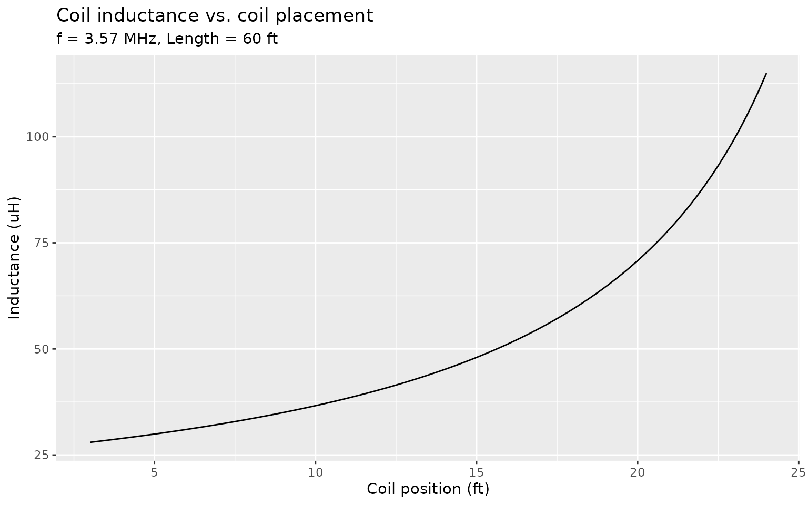
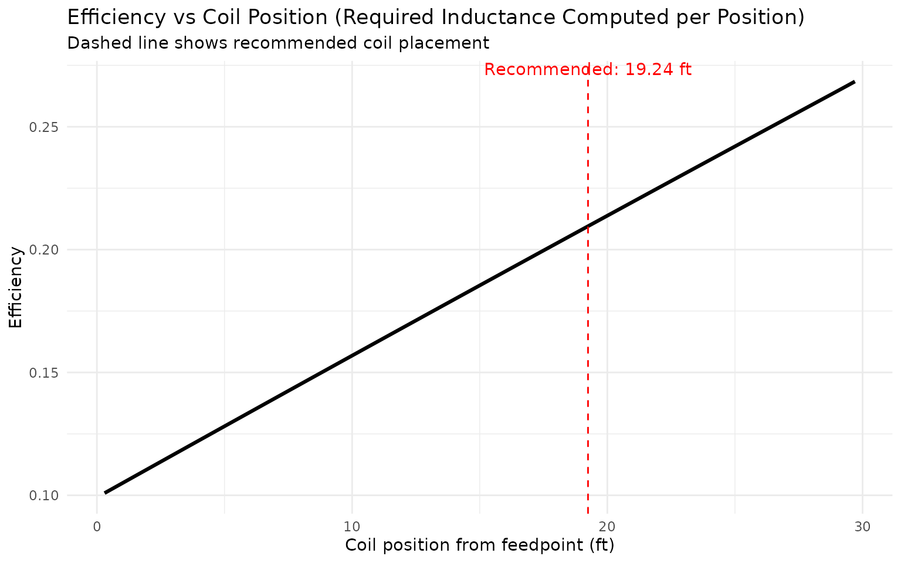
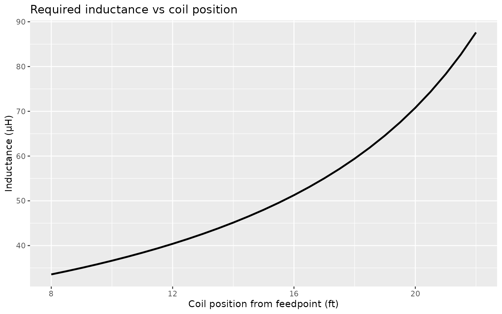
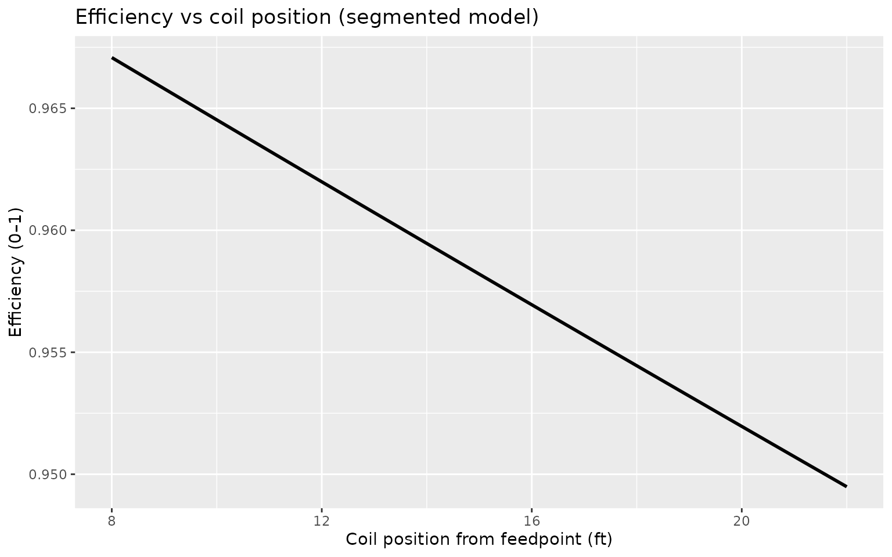
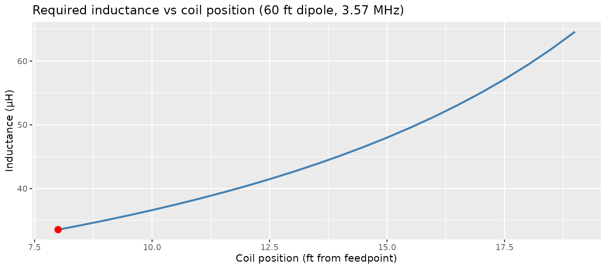
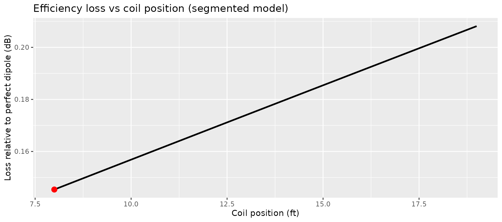
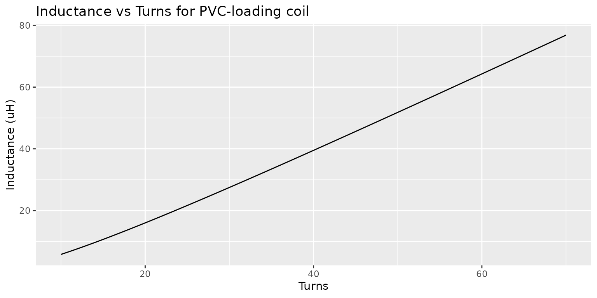

# Designing a 60 ft Loaded 80 m Dipole with loadedDipole

``` r
library(loadedDipole)
```

## Overview

This vignette walks through the design of a shortened 80 m dipole for
3.57 MHz FT8, using a total wire length of 60 ft and a pair of available
66 µH loading coils.

We will:

1.  Compute the recommended coil placement.
2.  Visualise inductance versus coil placement.
3.  Estimate radiation efficiency for the final design.

## Antenna and coil parameters

``` r
frequency    <- 3.57     # MHz (FT8)
total_length <- 60       # ft
L_coil       <- 66       # microhenry per coil
```

## 1. Recommended coil placement

``` r
rec <- recommend_coil_position(
  frequency    = frequency,
  total_length = total_length,
  inductance   = L_coil
)

rec
```

    ## Loaded dipole recommendation:
    ##   Frequency        : 3.5700 MHz
    ##   Total length     : 60.0000 ft
    ##   Coil inductance  : 66.0000 uH (per coil)
    ##   Coil position    : 19.2429 ft from feedpoint
    ##   Fraction of half : 0.641

The output reports the recommended distance from the feedpoint to each
coil (per leg) and the fraction of the half-element length at which the
coils are placed.

## 2. Inductance versus placement

``` r
plot_inductor_placement(
  frequency    = frequency,
  total_length = total_length
)
```



This plot shows the required inductance as a function of coil position
for the chosen frequency and total length. The recommended coil position
is indicated by a dashed vertical line.

## 3. Efficiency estimate

``` r
eff <- estimate_efficiency(
  frequency       = frequency,
  total_length    = total_length,
  coil_inductance = L_coil,
  coil_position   = rec$coil_position,
  model           = "both"
)

eff
```

    ## $efficiency_simple
    ## [1] 0.9397193
    ## 
    ## $efficiency_segmented
    ## [1] 0.9529011
    ## 
    ## $efficiency
    ## [1] 0.9463102

The resulting table reports approximate radiation resistance, loss
resistance and overall radiation efficiency for two simple models:

- `simple`: short-dipole radiation resistance plus coil loss.
- `segmented`: adds crude wire and ground loss and a tapered current
  model.

The estimates are intended for comparative design work and trade-off
studies rather than as a replacement for full NEC modelling.

## 4. Efficiency vs Coil Position (Realistic Sweep)

In this section we sweep **coil position** *and compute the required
inductance at each position*, then evaluate the efficiency. This gives a
realistic view of how coil placement affects performance.

``` r
library(ggplot2)

wire_diameter = 0.065

# sweep from 10% to 90% of half-length
half_len <- total_length / 2
fractions <- seq(0.01, 0.99, by = 0.01)
coil_positions <- fractions * half_len

eff_list <- lapply(seq_along(coil_positions), function(i) {
  B <- coil_positions[i]

  # compute required inductance at this coil position
  L_req <- loading_coil_inductance(
    frequency,
    total_length = total_length,
    coil_position = B,
    wire_diameter = wire_diameter,
    metric = FALSE
  )

  # compute efficiency using segmented model
  eff <- estimate_efficiency(
    frequency       = frequency,
    total_length    = total_length,
    coil_inductance = L_req,
    coil_position   = B,
    model           = "segmented"
  )

  data.frame(
    coil_position = B,
    fraction_of_half = fractions[i],
    inductance = L_req,
    efficiency = -10 * log10(eff$efficiency)

  )
})

eff_df <- do.call(rbind, eff_list)

# plot the result
ggplot(eff_df, aes(x = coil_position, y = efficiency)) +
  geom_line(size = 1.1) +
  geom_vline(
    xintercept = rec$coil_position,
    linetype = "dashed",
    color = "red"
  ) +
  annotate(
    "text",
    x = rec$coil_position,
    y = max(eff_df$efficiency),
    label = sprintf("Recommended: %.2f ft", rec$coil_position),
    vjust = -0.5,
    color = "red"
  ) +
  labs(
    x = "Coil position from feedpoint (ft)",
    y = "Efficiency",
    title = "Efficiency vs Coil Position (Required Inductance Computed per Position)",
    subtitle = "Dashed line shows recommended coil placement"
  ) +
  theme_minimal()
```

    ## Warning: Using `size` aesthetic for lines was deprecated in ggplot2 3.4.0.
    ## ℹ Please use `linewidth` instead.
    ## This warning is displayed once every 8 hours.
    ## Call `lifecycle::last_lifecycle_warnings()` to see where this warning was
    ## generated.



This sweep computes:

- the *actual required inductance* at each B  
- the corresponding coil loss  
- the effect of shortening on radiation resistance  
- and thus the true efficiency curve

## Optimizing coil inductance vs placement

A common design question is:

> *“If I move the coils inward, can I use a smaller inductance without
> hurting efficiency?”*

[`optimize_inductance_for_position()`](https://yojimbodurant.github.io/loadedDipole/reference/optimize_inductance_for_position.md)
allows us to sweep coil placements, compute the required inductance, and
optionally compute efficiency.

Here we analyze a 60 ft 80-meter dipole at 3.57 MHz:

``` r
positions <- seq(8, 22, by = 0.5)   # ft from feedpoint

opt_df <- optimize_inductance_for_position(
  frequency       = 3.57,
  total_length    = 60,
  positions       = positions,
  efficiency      = TRUE,
  efficiency_model = "segmented"
)

opt_df
```

    ##    coil_position inductance eff_segmented
    ## 1            8.0   33.56123     0.9670797
    ## 2            8.5   34.27028     0.9664402
    ## 3            9.0   35.01492     0.9658015
    ## 4            9.5   35.79772     0.9651637
    ## 5           10.0   36.62151     0.9645267
    ## 6           10.5   37.48939     0.9638906
    ## 7           11.0   38.40478     0.9632553
    ## 8           11.5   39.37147     0.9626208
    ## 9           12.0   40.39365     0.9619872
    ## 10          12.5   41.47597     0.9613544
    ## 11          13.0   42.62362     0.9607224
    ## 12          13.5   43.84239     0.9600913
    ## 13          14.0   45.13876     0.9594610
    ## 14          14.5   46.52003     0.9588315
    ## 15          15.0   47.99443     0.9582028
    ## 16          15.5   49.57129     0.9575750
    ## 17          16.0   51.26121     0.9569480
    ## 18          16.5   53.07632     0.9563218
    ## 19          17.0   55.03050     0.9556964
    ## 20          17.5   57.13979     0.9550718
    ## 21          18.0   59.42280     0.9544481
    ## 22          18.5   61.90120     0.9538251
    ## 23          19.0   64.60045     0.9532030
    ## 24          19.5   67.55064     0.9525817
    ## 25          20.0   70.78758     0.9519612
    ## 26          20.5   74.35429     0.9513414
    ## 27          21.0   78.30285     0.9507225
    ## 28          21.5   82.69702     0.9501044
    ## 29          22.0   87.61569     0.9494871

We can now visualize how inductance and efficiency vary with coil
placement:

``` r
ggplot(opt_df, aes(x = coil_position, y = inductance)) +
  geom_line(size = 1) +
  labs(
    title = "Required inductance vs coil position",
    x     = "Coil position from feedpoint (ft)",
    y     = "Inductance (µH)"
  )
```



``` r
ggplot(opt_df, aes(x = coil_position, y = eff_segmented)) +
  geom_line(size = 1) +
  labs(
    title = "Efficiency vs coil position (segmented model)",
    x     = "Coil position from feedpoint (ft)",
    y     = "Efficiency (0–1)"
  )
```



This demonstrates that:

- Moving coils inward reduces required inductance dramatically  
- Efficiency stays nearly flat, as expected for a short 80-meter
  dipole  
- Practical positions (≈10–15 ft from the feedpoint) allow much smaller,
  lower-loss coils without meaningful loss of radiated power

## Designing a loaded dipole when only the total length is known

Often a builder only knows the available span (e.g., 60 ft) and wishes
to design the rest of the antenna with the constraint that the loading
coils must not exceed some value. Here we solve the problem for a 60 ft
dipole at 3.57 MHz, allowing coils of up to 66 µH.

``` r
library(loadedDipole)

design <- design_loaded_dipole(
  frequency    = 3.57,
  total_length = 60,
  L_max        = 66
)

design$best
```

    ##   coil_position inductance efficiency   loss_dB
    ## 1             8   33.56123  0.9670797 0.1453773

The output gives the recommended coil placement and inductance that:

1.  Requires no more than 66 µH,  
2.  Is within 0.1 dB of the best achievable efficiency, and  
3.  Uses the smallest inductance within that range.

We can also visualize the entire design space:

``` r
library(ggplot2)

df <- design$designs

ggplot(df, aes(x = coil_position, y = inductance)) +
  geom_line(color="steelblue", size=1) +
  geom_point(data = design$best, aes(x = coil_position, y = inductance),
             color="red", size=3) +
  labs(
    title = "Required inductance vs coil position (60 ft dipole, 3.57 MHz)",
    x = "Coil position (ft from feedpoint)",
    y = "Inductance (µH)"
  )
```



``` r
ggplot(df, aes(x = coil_position, y = loss_dB)) +
  geom_line(size=1) +
  geom_point(data = design$best, aes(x = coil_position, y = loss_dB),
             color="red", size=3) +
  labs(
    title = "Efficiency loss vs coil position (segmented model)",
    x = "Coil position (ft)",
    y = "Loss relative to perfect dipole (dB)"
  )
```



## Designing and Building the Loading Coils

Once the optimal coil inductance is found (e.g., ~33.5 uH at 8 ft from
the feedpoint), we can design the actual coils using PVC pipe and common
magnet wire. The function
[`design_pvc_coil()`](https://yojimbodurant.github.io/loadedDipole/reference/design_pvc_coil.md)
computes the required turns, coil geometry, and a ±2 turn table showing
how inductance varies with turn count.

In this example, we design a 33.5 uH coil on 1.5 inch Schedule 40 PVC
with AWG 14 wire (0.064”) and 0.070” turn spacing:

``` r
coil <- design_pvc_coil(
  inductance     = 33.5,
  pvc_size       = "1-1/2",
  wire_diameter  = 0.064,
  turn_spacing   = 0.070
)

coil
```

    ## $turns
    ## [1] 35.04055
    ## 
    ## $winding_length_in
    ## [1] 2.452839
    ## 
    ## $diameter_in
    ## [1] 1.9
    ## 
    ## $wire_length_ft
    ## [1] 17.42983
    ## 
    ## $summary_table
    ##   turns inductance_uH winding_length_in
    ## 1    33      31.05284              2.31
    ## 2    34      32.25008              2.38
    ## 3    35      33.45121              2.45
    ## 4    36      34.65600              2.52
    ## 5    37      35.86422              2.59

This gives:

- The computed turns (`coil$turns`),
- Winding length,
- Wire length,
- And a small table showing `turns +/- 2` so you can easily trim or add
  turns.

We can also visualize inductance vs turns for this PVC size:

``` r
plot_coil_turns(
  pvc_size       = "1-1/2",
  wire_diameter  = 0.064,
  turn_spacing   = 0.070,
  N_range        = 10:70
)
```



In practice, wind one or two turns extra, measure the inductance using
an LCR meter or analyzer, and remove/spread turns until the value
matches the design target.
